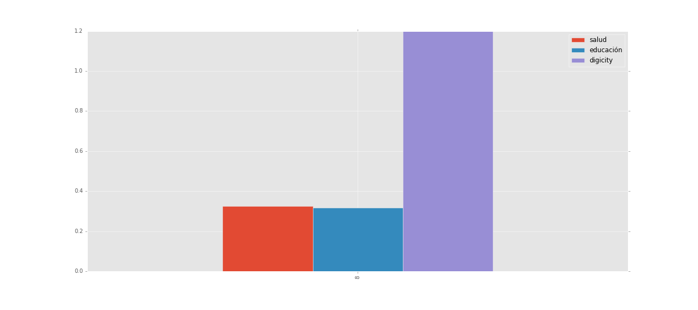

# Proyecto-final-MCPP---Analisis-politica-igital-a-traves-de-los-planes-de-desarrollo-municipales
Trabajo final de la clase MCPP_2016 II

# MCPP_nathalie.basto
# Analisis de la importancia de la politica TIC en los planes de desarrollo municipales-Noviembre de 2016

---

## Descripción y motivación 

En los últimos años el incremento en el uso de las tecnologías de la información y las telecomunicaciones, incluido el internet, ha influido en la forma cómo se desarrollan y crecen las ciudades en el mundo y cómo sus gobiernos planifican  proveen sus diferentes servicios. Las ciudades aspiran a crear ambientes interconectados en los que las Tecnologías de la Información y la Comunicación (en adelante TIC) estén al servicio del desarrollo sostenible y su uso sea un elemento habilitador para crecer y mejorar en todas sus variables socioeconómicas con el objetivo de aumentar la calidad de vida de los ciudadanos. 

Parte fundamental para avanzar en la política es lograr que las ciudades se midan y se comparen con sus pares. Este este trabajo busca presentar una descripción de la política pública territorial en materia digital y de tecnologías a través de un análisis de los textos de los planes de desarrollo municipales de las 23 principales ciudades del país, para los periodos 2012-2015, que normalmente son de acceso público y están colgados en las páginas web de las alcaldías municipales de las ciudades mas grandes del país, donde se intenta visualizar a través de un análisis de lenguaje natural que tanta importancia están dando las políticas en las ciudades a temas relacionados con la promoción de TIC y su importancia relativa con respecto a otros temas de interés urbanos. 

Para lo anterior se plantea hacer una análisis basándose en una lista de palabras relacionadas con ciudades inteligentes y digitales y otros temas tradicionales de política pública: TIC tics innovador inteligente digital ciencia tecnología sostenible internet penetración comunicaciones conectar apropiación competitividad conectividad capacidad computador interconectada creatividad productivo sostenible innovador optimización ciudad_sostenible cuidad_inteligente ciudad_digital ciudad_i digitalización I+D investigaccion desarrollo educación salud movilidad transporte comercio seguridad justicia trabajo industria turismo ambiente vivienda minería corrupción agro cultura deporte.

Con estas palabras se buscan recolctar sus frecuencias absolutas y relativas en los planes de desarrollo y poder ilustrarlas junto con algunos indicadores objetivos de el despliegue de TIC en el país para visualizar como está el panorama de política digital en el país. Además se presentaran nubes de palabras por ciudad, y mapas que permitan sintetizar la evidencia respecto al tema. Finalmente se analizará la relación entre la presencia del tema TIC en la política y los  indicadores de tecnologías objetivos a final del periodo de gobierno 2012-2015, para lo que se presentaran gráficos de dispersión. Los indicadores objetivos a usar son: Velocidad de bajada, Índice de calidad de la demanda, Penetración por 1000 habitantes estas tomadas del reporte de la base de información sobre acceso y uso de operadores de internet fijo de la Comisión de Regulación de Comunicaciones (en adelante CRC), y algunas otras variables sociodemograficas. [here] (socioeconomicos.csv)

## Metodos usados

1. leer los archivos en txt:
-los archivos y usar metodos de los strings, las listas, los diccionarios, etc para poder subir los archivos de forma que permitan construir una base de datos 
    - los planes de desarrollo vienen de las URL's de las alcaldias.
        - Dado que cada pagina es diferente no se hizo webscrapping sino que se descargo manualmente.
        - se construye el dicionario de cada ciudad con su plan de desarrollo (dado que estan en español debe usarse un encoding especifico)
    
2. extraer los textos a un data frame:
    - Para esto se usa Pandas
  
3. Manejar y limpiar el texto:
    - se usan regular expresions con la libreria regex
    - se usa metodos NLTK  y string, y se construyen funciones, para eliminar puntuación, poner en minusculas, quitar los stopwords personalizados,  
    
4. hacer analisis y graficas de dispersión, barras, dispersión del lexico, se sacan estadisticas de frecuencias relativas y absolutas por palabra:
    - se usan nltk, numpy, matplotlib, y pandas
5. hacer merge con la encuesta de la crc de indicadores objetivos para hacer graficas de dispersión entre estos y nuestra variable de importancia relativa de la politica TIC
6. se exporta la base a excel para hacer un mapa de la variable en arcgis
7. se hace nubes de palabras en R: [here] (nubes.R)
    - se usan librerias word cloud y TM. [here] (nubes.R) y una explicación en de como se implementa el codigo aca [here] (nubes explicacion en R.doc)
    
    Todos los archivos necesarios para replicar el ejericicio estan aca 
    
## hallazgos 

Too el codigo para el analisis esta disponible [here] (Proyecto versión 1 - copia.ipynb)

- La politica TIC tiene poca importancia relativa frente a otras politicas 

Algunas visualizaciones:

soacha es el municipio con mas diversidad del lexico

importancia de alguna de las politicas relacionada con TIC

importancia de alguna de las politicas relacionada con TIC por ciudad con salud y educación
Ej: Chia

ispersión entre la politica de puntos vive digital de MinTIC y la importancia relativa de la politica TIC en el municipio

---
